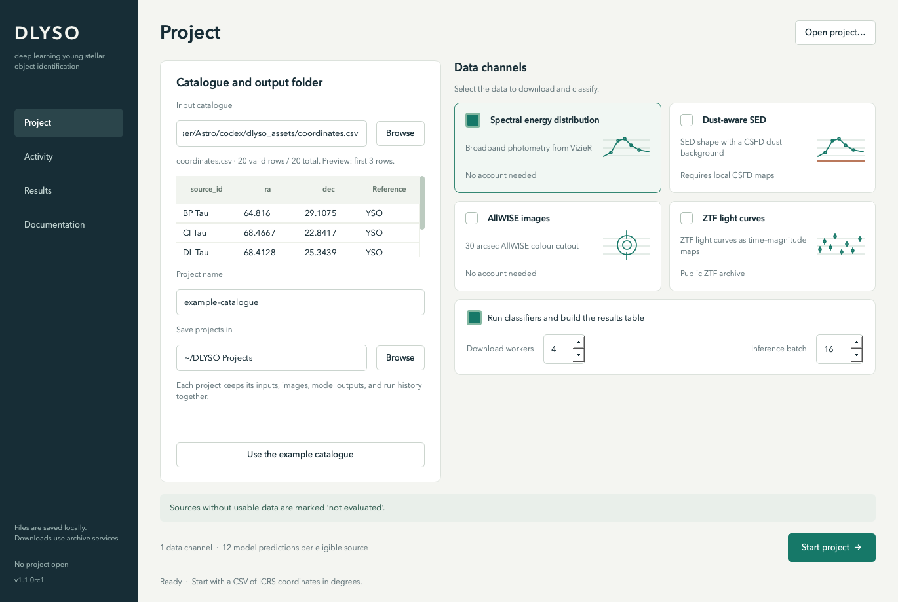
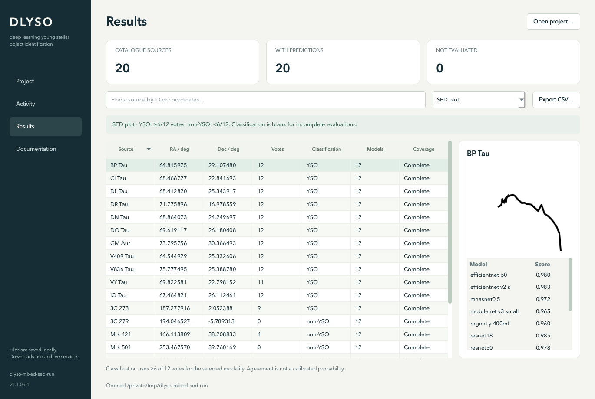

# DLYSO

Software for young stellar object classification.

DLYSO downloads photometry, AllWISE images and ZTF light curves for a catalogue of sky coordinates. It creates input images, runs the classifiers and saves per-source model scores. The GUI provides project settings, an activity log and a results table.



**Release candidate: 1.1.0rc1.** The software includes regression tests and installation checks. Scientific performance is not established by those checks; see the [model card](docs/MODEL_CARD.md). Author, license and model redistribution metadata must be finalized before public distribution.

## Installation

### 1. Choose a Python environment

Use Python 3.10 or newer and Git. A virtual environment keeps DLYSO's Python dependencies separate from other software. It is recommended, but it is not a second installation method. If you already have a suitable environment (for example, a dedicated conda environment), activate it and continue to step 2.

To create a new environment, run this once in a folder where you want to keep it:

```bash
python -m venv .venv
```

Then activate it using the command for your shell:

| Shell | Activation command |
|---|---|
| macOS / Linux (bash or zsh) | `source .venv/bin/activate` |
| Windows PowerShell | `.venv\Scripts\Activate.ps1` |
| Windows Command Prompt | `.venv\Scripts\activate.bat` |

If your system provides `python3` instead of `python`, use `python3` for the environment-creation command. The commands below use `python` inside the activated environment.

### 2. Install DLYSO and its data once

For access to a private repository, sign in with GitHub CLI (`gh auth login`) and configure Git access (`gh auth setup-git`) first.

Run these two commands in your chosen environment. No source-folder download or clone is needed:

```bash
python -m pip install "dlyso-pipeline[gui] @ git+https://github.com/martongabor/DLYSO.git"
dlyso-setup
```

The first command installs the application and Python dependencies. The second downloads and verifies all 48 models and any missing CSFD dust maps, placing them where DLYSO finds them automatically. No manual ZIP extraction is needed. Use `dlyso-setup --skip-dust` if you do not need the dust-aware SED channel.

### 3. Start the GUI

```bash
dlyso-gui
```

In a new terminal, activate the same environment before starting DLYSO. You do not need to recreate the environment or reinstall the application each time. If you already installed DLYSO successfully in an existing environment, keep using that environment; these instructions do not require a second installation.

For Linux system libraries, installation checks, file locations and the alternative source-checkout route, see the [installation guide](docs/GITHUB_INSTALL.md).

## First project

In the app:

1. Click **Use the example catalogue** (11 named sources with verified public ZTF light curves), or browse to your own CSV.
2. Choose a project name and destination. Leave **Spectral energy distribution** selected for a first run.
3. Click **Start project**. The Activity page shows actual stage states and saves a log.
4. Open **Results** to inspect images, individual scores and missing-data coverage.

Archive services are contacted during a run. Opening existing results and reading the guide work offline.

## Data channels

| Channel | Data | Additional requirement |
|---|---|---|
| Spectral energy distribution | VizieR SED photometry | Network access |
| Dust-aware SED | SED photometry + CSFD dust background | Local CSFD maps |
| AllWISE images | AllWISE colour cutouts | Network access |
| ZTF light curves | ZTF light curves → DTDM images | Network access |

Each eligible source has up to **12 model scores per channel**: ten torchvision architectures and two custom models. These are separate predictions. DLYSO does not claim a calibrated, combined probability across channels.

## Input and output

```csv
source_id,ra,dec
BP Tau,64.81597493,29.10747971
CI Tau,68.46672665,22.8416928
```

Coordinates are ICRS decimal degrees. Invalid rows are recorded in `rejected_rows.csv`; valid input columns are retained. The final `result.csv` includes each model score, a vote count, the number of models evaluated and a coverage status. **No data means `not_evaluated` and blank votes, never zero votes.**



## Command line

```bash
# Validate without contacting archive services
python dlyso.py examples/coordinates.csv --runroot runs/first-check --steps preflight

# Download AllWISE images only
python dlyso.py examples/coordinates.csv --runroot runs/infrared --steps allwise --workers 4

# See all stage presets and parameters
python dlyso.py --help
```

Each channel starts classification as soon as its representation is ready, independently of slower downloads. Failed channels do not cancel healthy ones; results appear incrementally. The desktop supports arbitrary channel combinations. CLI `all` selects all four channels, including dust-aware SEDs; install CSFD maps first. CLI `sed_classify` also includes the dust-aware channel. [CLI reference →](docs/CLI_REFERENCE.md)

## Documentation

- [User guide](docs/USER_GUIDE.md) — installation, first project, resuming, results and troubleshooting.
- [Output reference](docs/OUTPUT_SCHEMA.md) — field definitions, missingness and thresholds.
- [Model card](docs/MODEL_CARD.md) — preprocessing, intended use and scientific limitations.
- [Developer guide](docs/DEVELOPMENT.md) — architecture, checks and release assembly.
- [Release checklist](docs/RELEASE_CHECKLIST.md) — remaining publication metadata and validation gates.
- [Offline reference](dlyso_pipeline_docs.html) — the complete guide in one searchable, self-contained file.

## Development

```bash
python -m pip install -e ".[dev]"
python -m pytest -q
python -m ruff check .
python tools/render_docs.py
python tools/build_release.py
```

Tests use synthetic inputs and mocked network failures. Full inference and archive access have separate opt-in smoke checks. The unrelated Local Bubble visualization and filter-analysis scripts remain in the working folder; they are outside the DLYSO software release.
